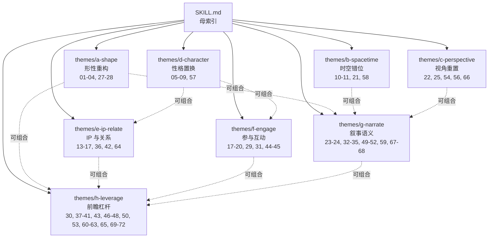

# 创意72变 · 引用图 + INDEX

> 本 skill 集的 Zettelkasten 链接 + 主入口。

---

## 主入口

`SKILL.md`（`/creative-72-transformations/SKILL.md`）— **母索引：选族 + 路由**

## 8 大 sub-skill 引用图

> 实线=路由，虚线=组合关系。

---

## 与兄弟 skill 的移交链接

| 当创意方向确立后要做... | 移交到 |
|---|---|
| 文案主笔（品牌宣言/活动文案/海报文案） | `master-copywriter` |
| KV / 封面 / 海报 | `wenrouhu-design` 或 `hiccai-title-pic` |
| 短视频脚本 | `hiccai-douyin` |
| 小红书内容 | `hiccai-xhs` |
| 媒介投放 | `recommend-connectors` |
| 故事/剧本 | `hiccai-story` |
| 话题事件传播 | `hiccai-Hook` 或 `hiccai-social` |
| 创意策略/品牌定位 | `dichanfangan` 或 `hiccai-creative` |
| 地产/高端品牌/奢侈品 | `hiccai-wenan` |

---

## SKILL 之间互相引用的索引

| 当前 skill | 引用了 | 用于 |
|---|---|---|
| 主入口 SKILL.md | themes/a-h 每个 sub-skill | 路由 |
| themes/a-shape | themes/b, d, g | 组合拳 |
| themes/b-spacetime | themes/a, g, h | 组合拳 |
| themes/c-perspective | themes/b, d, g | 组合拳 |
| themes/d-character | themes/c, e, h | 组合拳 |
| themes/e-ip-relate | themes/f, g, h | 组合拳 |
| themes/f-engage | themes/e, g, h | 组合拳 |
| themes/g-narrate | themes/c, f, h | 组合拳 |
| themes/h-leverage | 全部 + 兄弟 skill | 杠杆放大 |

---

## 8 大 sub-skill 的触发关键词速查

| sub-skill | 触发关键词 |
|---|---|
| a-shape | 变大变小、拟人拟物、性别反转、形变、视觉奇观 |
| b-spacetime | 复古、致敬、穿越、怀旧、零预算、倒退 |
| c-perspective | 第一人称、POV、沉浸感、内心独白、不可见、分屏 |
| d-character | 魔性、洗脑、可爱、温情、人格化、借喻、反差感 |
| e-ip-relate | 联名、IP、明星、达人、KOL、动物园品牌、同盟 |
| f-engage | 事件营销、H5、UGC、快闪、装置、游戏化、挑战赛 |
| g-narrate | 讲故事、Hero film、长文案、对比、反转、manifesto、公益、夸张 |
| h-leverage | 借势、节日、social、小红书、抖音、AI、AR、VR、科技、截屏 |

> 用户没说清要走哪条主题时，按上述关键词反查对应主题。
